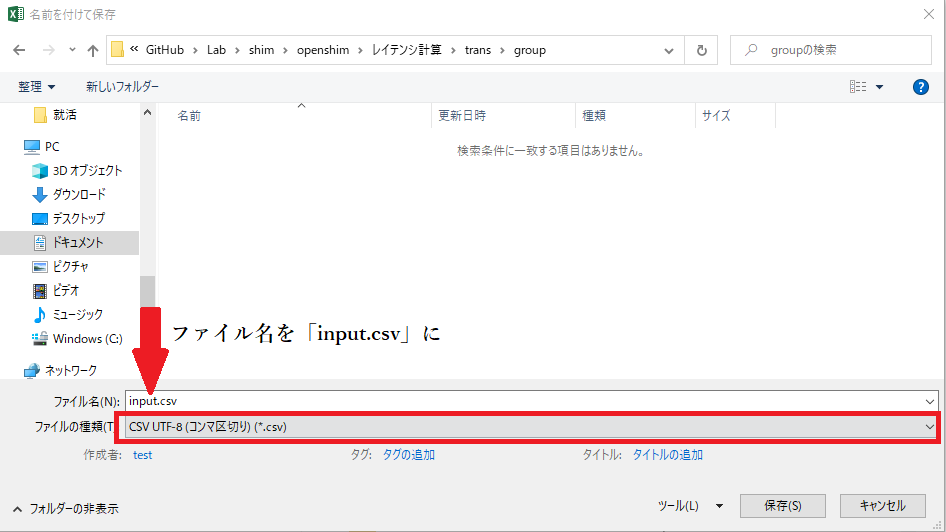

# Latency calculation

[Latency calculation](#Latency calculation)
  - [Description](#Description)
  - [Preparation for latency calculation](#Preparation-for-latency-calculation)
    - [Preparation](#Preparation)
    - [Exclude outliers](#Exclude-outliers)
      - [Place *csv* files](#Place-*csv*-files)
      - [Import into **ExcludeValues.xlsm** ](#Import-into-**ExcludeValues.xlsm** )
      - [Exclusion of outliers](#Exclusion-of-outliers)
        - [In the case of extremely high outliers](#In-the-case-of-extremely-high-outliers)
  - [Procedure for latency calculation](#Procedure-for-latency-calculation) 
      - [Fill out *summary* sheet with the required information](#Fill-out-*summary*-sheet-with-the-required-information)
      - [Latency calculation by regression analysis](#Latency-calculation-by-regression-analysis)
  - [Convert to *csv*](#Convert-to-*csv*)
      - [Run the macro to generate a *csv* file](#Run-the-macro-to-generate-a-*csv*-file)
      - [Save the file in *csv* format](#Save-the-file-in-*csv*-format)
      - [Convert to follow the rules of the Latency Insertion Tool](#Convert-to-follow-the-rules-of-the-Latency-Insertion-Tool)

## Description

This directory provides latency calculation based on the files obtained from the actual device measurement.

## Preparation for latency calculation
### Preparation

The following tools are required to run the programs.

+ Environment in which macros can be executed in *xlsx*，*xlsm* file
+ *xlsx*，*xlsm* ファイルでマクロが実行できる環境
  + Confirm execution in *Excel Office 2019*

The file to prepare are as follows:

+ *csv* files obtained by [mesure](../mesure).

### Exclude outliers

Exclude outliers from the results obtained from the actual measurement. 
The procedure is as follows:

#### Place *csv* files

Place all the files obtained from the actual measurement in [*ExcludeValues*](/ExcludeValues).

#### Import into **ExcludeValues.xlsm** 

1. Open [**ExcludeValues.xlsm**](/ExcludeValues/ExcludeValues.xlsm) 
2. Excute 「Repeating_CSV」 by 「View」→「Macro」
3. Make sure all csv files have been added as new sheets


#### Exclusion of outliers

1. Run the macro 「Run_median_macro」 as well.
2. Set tolerances.
   + Set a percentage between 0 and 1, such as 0.2 or 0.1
   + If you are not particular about the range, set both items to 0.1
3. Comfirm that the excluded results are printed on *sheet1*.

##### In the case of extremely high outliers

There may be many extreme outliers due to uniformly set tolerances.
In that case, if you manually rewrite the 「upper」 and 「lower」 limits of the *L1Access/Refill* count in the sheet of each imported *csv* file, the calculation will be recalculated and reflected.

### Procedure for latency calculation

[**calc.xlsm**](/calc.xlsm) is used to calculate the latency. 
The procedure is as follows:

1. [Fill out *summary* sheet with the required information](#Fill-out-*summary*-sheet-with-the-required-information)
2. [Latency calculation by regression analysis](#Latency-calculation-by-regression-analysis)

#### Fill out *summary* sheet with the required information

Enter the necessary information on the summary sheet in [**calc.xlsm**](/calc.xlsm) .
The items to be entered are as follows:

+ Value of *sheet1* of **ExcludeValues.xlsm**
  + Enter *TotalCycle* into *TotalCycle* on [**calc.xlsm**](/calc.xlsm) summary sheet and regression analysis sheet
  + Enter the new miss rate into the *L1* miss rate on the summary sheet.
  + Enter the new average value of *L1-D-Access* into *L1* Access
+ Value of *summary* sheet of [**calc.xlsm**](/calc.xlsm)
  + Enter the MemoryRead into *MemRead* in *regression* sheet
  + Enter the MemoryWrite into *MemWrite* in *regression* sheet
  + Enter *L1* accesses into *CacheAccess* on the *regression* sheet

※ The orange cells on both sheets should be fully filled.

#### Latency calculation by regression analysis

In the regression analysis sheet, calculate the latency of each variable using the solver function.
In this file, the latency is calculated by the least-squares method for the actual machine execution cycle and the estimation cycle.

Regression analysis is performed by selecting 「Data」→「Solver」 and setting each parameter as follows:

```bash
・Set Objective：AA2 (cell of gray)
・To：Min
・By Changing Variable Cells：C2～X2 (cell of green and red)
・Subject to the Constraints：
  - Row 2(cell of green and red) is Non-Negative
  - Colimn AA(The square of the difference between the actual execution cycle and the estimation cycle) is within ±0.2
・Make Unconstrained Variables Non-Negative：☑
・Select a Solving Method：GRG Nonlinear
```

The calculated latency will be output in the green cell of the second row.
Even if no solution is found that satisfies the constraints, the optimal latency will be obtained.

### Convert to *csv*

Convert the latency to a csv file that can be used by the tool to insert the latency into SHIM. 
The procedure is as follows:

1. [Run the macro to generate a *csv* file](#Run-the-macro-to-generate-a-*csv*file)
2. [Save the file in *csv* format](#Save-the-file-in-*csv*-format)
3. [Convert to follow the rules of the Latency Insertion Tool](#Convert-to-follow-the-rules-of-the-Latency-Insertion-Tool.)

#### Run the macro to generate a *csv* file

Extract only the instruction name and latency cells from [**calc.xlsm**](/calc.xlsm) used in the previous step.
Click 「View」→「Macro」→「*outputCSV*」. 
If a new file with only green and blue cells is generated, you have succeeded.

#### Save the file in *csv* format

Save the file with 「Save As」. Please note the following three points.

+ Set the file type to CSV
+ Change the file name to 「**input.csv**」
+ Save in [latency/*trans*/*inst*](trans/inst)



#### Convert to follow the rules of the Latency Insertion Tool

Run **transcsv.py** to convert the *csv* file you just created into a form compatible with the Latency Insertion Tool.
By executing the following command in the *trans* directory, 「**output.csv**」 will be output.

`python transcsv.py`

For an example of the output file(**output.csv**), see [**sample.csv**](. /trans/sample.csv).